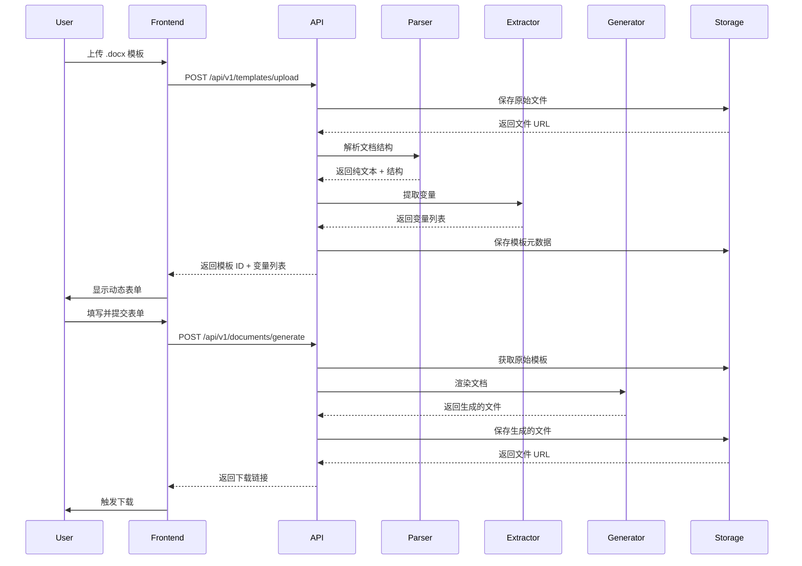

# 智能合同模板系统重构方案

## 📋 项目概述

### 当前状态
- **前端**: Next.js 14 + TypeScript + Tailwind CSS
- **后端**: Next.js API Routes (Vercel Serverless Functions)
- **数据库**: PostgreSQL + Prisma ORM
- **核心功能**: 飞书文档集成、OCR识别、文本替换

### 重构目标
将系统重构为**专注于合同模板处理**的应用，采用前后端完全分离的架构：
- **Python FastAPI** 后端（部署在 Leaflow）
- **Next.js** 前端（部署在 Vercel）
- **核心流程**: 模板上传 → AI变量提取 → 动态表单 → 高保真文档生成

---

## 🏗️ 新架构设计

### 系统架构图

```
┌─────────────────────────────────────────────────────────────┐
│                        用户浏览器                              │
│                      (Next.js 前端)                           │
└────────────────────┬────────────────────────────────────────┘
                     │ HTTPS
                     ↓
┌─────────────────────────────────────────────────────────────┐
│                   API 网关 & 路由层                           │
│                  (FastAPI 后端服务)                           │
└────┬──────────┬──────────┬──────────┬──────────────────────┘
     │          │          │          │
     ↓          ↓          ↓          ↓
┌────────┐ ┌────────┐ ┌────────┐ ┌────────┐
│模块一  │ │模块二  │ │模块三  │ │模块四  │
│文档解析│ │AI提取  │ │表单生成│ │文档生成│
│python- │ │Lang-   │ │动态映射│ │python- │
│docx    │ │Extract │ │        │ │docx-   │
│        │ │        │ │        │ │template│
└────────┘ └────────┘ └────────┘ └────────┘
     │          │          │          │
     └──────────┴──────────┴──────────┘
                     │
                     ↓
         ┌───────────────────────┐
         │   PostgreSQL 数据库    │
         │   (Vercel Postgres)   │
         └───────────────────────┘
         ┌───────────────────────┐
         │   文件存储系统         │
         │   (Vercel Blob)       │
         └───────────────────────┘
```

---

## 🔧 四大核心模块详解

### 模块一：模板解析服务 (Document Parser)

**技术栈**: `python-docx`

**功能职责**:
1. 接收用户上传的 `.docx` 模板文件
2. 提取纯文本内容（按阅读顺序）
3. 保留文档结构信息（段落、表格、样式）
4. 识别文档元数据

**核心代码示例**:
```python
from docx import Document
from typing import Dict, List, Any

class DocumentParser:
    def __init__(self, file_path: str):
        self.doc = Document(file_path)
    
    def extract_text(self) -> str:
        """提取文档全文"""
        full_text = []
        
        # 提取段落文本
        for para in self.doc.paragraphs:
            if para.text.strip():
                full_text.append(para.text)
        
        # 提取表格文本
        for table in self.doc.tables:
            for row in table.rows:
                for cell in row.cells:
                    if cell.text.strip():
                        full_text.append(cell.text)
        
        return "\n".join(full_text)
    
    def get_structure(self) -> Dict[str, Any]:
        """获取文档结构"""
        return {
            "paragraphs_count": len(self.doc.paragraphs),
            "tables_count": len(self.doc.tables),
            "sections_count": len(self.doc.sections)
        }
```

**API 端点**:
```
POST /api/v1/documents/parse
- 输入: multipart/form-data (docx file)
- 输出: {
    "text": "全文文本内容",
    "structure": {...},
    "metadata": {...}
  }
```

---

### 模块二：AI 变量提取服务 (Variable Extractor)

**技术栈**: `LangExtract` + `Gemini API`

**功能职责**:
1. 接收纯文本内容
2. 使用 LangExtract 调用大语言模型
3. 识别合同中的关键变量字段
4. 返回结构化的变量列表（JSON Schema）

**核心实现**:
```python
from langextract import LangExtract
from typing import List, Dict

class VariableExtractor:
    def __init__(self, api_key: str, model: str = "gemini-2.5-flash"):
        self.extractor = LangExtract(api_key=api_key, model=model)
    
    def extract_variables(self, text: str) -> List[Dict]:
        """提取合同变量"""
        prompt = """
        分析以下合同文本，提取所有需要填写的变量字段。
        对于每个变量，返回：
        - name: 变量名称（英文标识符）
        - label: 显示标签（中文）
        - type: 数据类型 (text/number/date/boolean/select)
        - required: 是否必填
        - default: 默认值（如有）
        - options: 选项列表（如果是select类型）
        
        合同文本：
        {text}
        """
        
        schema = {
            "type": "array",
            "items": {
                "type": "object",
                "properties": {
                    "name": {"type": "string"},
                    "label": {"type": "string"},
                    "type": {"type": "string", "enum": ["text", "number", "date", "boolean", "select"]},
                    "required": {"type": "boolean"},
                    "default": {"type": "string"},
                    "options": {"type": "array", "items": {"type": "string"}}
                },
                "required": ["name", "label", "type"]
            }
        }
        
        result = self.extractor.extract(
            prompt=prompt.format(text=text),
            schema=schema
        )
        
        return result
```

**API 端点**:
```
POST /api/v1/variables/extract
- 输入: {"text": "合同全文", "examples": [...]}
- 输出: {
    "variables": [
      {
        "name": "party_a",
        "label": "甲方名称",
        "type": "text",
        "required": true
      },
      {
        "name": "contract_date",
        "label": "签订日期",
        "type": "date",
        "required": true
      },
      ...
    ]
  }
```

---

### 模块三：动态表单生成 (Form Generator)

**技术栈**: React Hook Form + Zod (前端) + FastAPI (后端)

**功能职责**:
1. 根据变量列表动态生成前端表单
2. 实现表单验证逻辑
3. 处理用户输入数据
4. 映射数据到文档占位符

**前端实现示例**:
```typescript
// src/components/DynamicForm.tsx
import { useForm } from 'react-hook-form';
import { zodResolver } from '@hookform/resolvers/zod';
import * as z from 'zod';

interface Variable {
  name: string;
  label: string;
  type: 'text' | 'number' | 'date' | 'boolean' | 'select';
  required: boolean;
  options?: string[];
}

export function DynamicForm({ variables, onSubmit }: Props) {
  // 动态生成 Zod Schema
  const schemaShape: any = {};
  variables.forEach(v => {
    let field = z.string();
    if (v.type === 'number') field = z.number();
    if (v.type === 'date') field = z.date();
    if (v.required) field = field.min(1, `${v.label}必填`);
    schemaShape[v.name] = field;
  });
  
  const schema = z.object(schemaShape);
  const { register, handleSubmit, formState: { errors } } = useForm({
    resolver: zodResolver(schema)
  });
  
  return (
    <form onSubmit={handleSubmit(onSubmit)}>
      {variables.map(variable => (
        <div key={variable.name}>
          <label>{variable.label}</label>
          {variable.type === 'text' && (
            <input {...register(variable.name)} type="text" />
          )}
          {variable.type === 'date' && (
            <input {...register(variable.name)} type="date" />
          )}
          {variable.type === 'select' && (
            <select {...register(variable.name)}>
              {variable.options?.map(opt => (
                <option key={opt} value={opt}>{opt}</option>
              ))}
            </select>
          )}
          {errors[variable.name] && (
            <span className="error">{errors[variable.name]?.message}</span>
          )}
        </div>
      ))}
      <button type="submit">生成合同</button>
    </form>
  );
}
```

**后端数据验证**:
```python
from pydantic import BaseModel, validator
from typing import Dict, Any

class FormData(BaseModel):
    template_id: str
    variables: Dict[str, Any]
    
    @validator('variables')
    def validate_variables(cls, v, values):
        # 根据模板定义验证数据
        return v
```

---

### 模块四：高保真文档生成 (Document Generator)

**技术栈**: `python-docx-template` (Jinja2)

**功能职责**:
1. 接收用户填写的数据和原始模板
2. 将数据渲染到 Jinja2 模板中
3. 生成最终的 `.docx` 文档
4. **关键**：保持原始模板的所有格式

**核心实现**:
```python
from docxtpl import DocxTemplate
from typing import Dict, Any
import io

class DocumentGenerator:
    def __init__(self, template_path: str):
        self.template = DocxTemplate(template_path)
    
    def render(self, context: Dict[str, Any]) -> bytes:
        """渲染文档"""
        # 填充数据
        self.template.render(context)
        
        # 保存到内存
        file_stream = io.BytesIO()
        self.template.save(file_stream)
        file_stream.seek(0)
        
        return file_stream.getvalue()
    
    def render_with_tables(self, context: Dict[str, Any], 
                          table_data: Dict[str, List[Dict]]) -> bytes:
        """渲染包含表格数据的文档"""
        # 合并上下文和表格数据
        full_context = {**context, **table_data}
        return self.render(full_context)
```

**模板格式示例**:
```
合同编号：{{ contract_number }}
甲方：{{ party_a }}
乙方：{{ party_b }}
签订日期：{{ contract_date }}


{{ loop.index }}. {{ item.name }} - {{ item.price }}元

```

**API 端点**:
```
POST /api/v1/documents/generate
- 输入: {
    "template_id": "uuid",
    "data": {
      "party_a": "某某公司",
      "contract_date": "2025-01-10",
      ...
    }
  }
- 输出: 二进制文件流 (application/vnd.openxmlformats-officedocument.wordprocessingml.document)
```

---

## 🗄️ 数据库设计

### 核心表结构

```sql
-- 模板表
CREATE TABLE templates (
    id UUID PRIMARY KEY DEFAULT gen_random_uuid(),
    user_id UUID NOT NULL REFERENCES users(id),
    name VARCHAR(255) NOT NULL,
    description TEXT,
    file_url TEXT NOT NULL,  -- Vercel Blob URL
    storage_key TEXT NOT NULL,
    
    -- 元数据
    file_size INTEGER,
    mime_type VARCHAR(100),
    
    -- 模板信息
    variables JSONB,  -- 存储变量定义
    structure JSONB,  -- 存储文档结构
    
    -- 状态
    status VARCHAR(50) DEFAULT 'active',  -- active, archived, deleted
    is_public BOOLEAN DEFAULT false,
    
    -- 统计
    usage_count INTEGER DEFAULT 0,
    last_used_at TIMESTAMP,
    
    created_at TIMESTAMP DEFAULT NOW(),
    updated_at TIMESTAMP DEFAULT NOW()
);

-- 生成记录表
CREATE TABLE generated_documents (
    id UUID PRIMARY KEY DEFAULT gen_random_uuid(),
    user_id UUID NOT NULL REFERENCES users(id),
    template_id UUID NOT NULL REFERENCES templates(id),
    
    -- 输入数据
    input_data JSONB NOT NULL,
    
    -- 输出文件
    output_url TEXT NOT NULL,  -- Vercel Blob URL
    storage_key TEXT NOT NULL,
    file_size INTEGER,
    
    -- 元数据
    generation_time INTEGER,  -- 毫秒
    status VARCHAR(50) DEFAULT 'completed',  -- pending, completed, failed
    error_message TEXT,
    
    created_at TIMESTAMP DEFAULT NOW()
);

-- 变量提取缓存表（优化性能）
CREATE TABLE variable_cache (
    id UUID PRIMARY KEY DEFAULT gen_random_uuid(),
    template_id UUID NOT NULL REFERENCES templates(id),
    text_hash VARCHAR(64) NOT NULL,  -- 文本内容的 SHA-256
    variables JSONB NOT NULL,
    created_at TIMESTAMP DEFAULT NOW(),
    
    UNIQUE(template_id, text_hash)
);
```

---

## 🚀 完整工作流程

### 用户视角流程

```
1. 上传模板
   ↓
2. 系统解析模板，提取变量
   ↓
3. 显示动态生成的表单
   ↓
4. 用户填写表单数据
   ↓
5. 点击"生成合同"
   ↓
6. 系统生成 .docx 文件
   ↓
7. 用户下载成品合同
```

### 技术实现流程



---

## 📦 技术栈总览

### Python 后端 (FastAPI)

```txt
# requirements.txt
fastapi==0.115.0
uvicorn[standard]==0.30.0
python-multipart==0.0.12
python-docx==1.1.2
python-docx-template==0.16.7
langextract==0.1.0  # 假设版本
pydantic==2.9.0
sqlalchemy==2.0.35
psycopg2-binary==2.9.9
alembic==1.13.3
python-jose[cryptography]==3.3.0
passlib[bcrypt]==1.7.4
python-dotenv==1.0.1
aiofiles==24.1.0
httpx==0.27.2
```

### 前端 (Next.js)

```json
{
  "dependencies": {
    "next": "14.2.5",
    "react": "^18",
    "react-dom": "^18",
    "react-hook-form": "^7.52.1",
    "@hookform/resolvers": "^3.7.0",
    "zod": "^3.23.8",
    "axios": "^1.7.2",
    "zustand": "^4.5.4",
    "tailwindcss": "^3.4.1",
    "lucide-react": "^0.408.0"
  }
}
```

---

## 🔄 分阶段迁移计划

### Phase 1: Python 后端基础搭建（第1-2周）

**目标**: 建立独立的 Python FastAPI 后端服务

**任务清单**:
- [ ] 初始化 FastAPI 项目结构
- [ ] 配置数据库连接（复用 Vercel Postgres）
- [ ] 实现用户认证 JWT 中间件
- [ ] 搭建文件上传/下载基础设施
- [ ] **模块一**: 实现文档解析服务
- [ ] 编写单元测试

**验收标准**:
```bash
curl -X POST http://localhost:8000/api/v1/documents/parse \
  -F "file=@template.docx" \
  -H "Authorization: Bearer <token>"
```

---

### Phase 2: AI 变量提取集成（第3周）

**目标**: 集成 LangExtract 和 Gemini API

**任务清单**:
- [ ] 注册并配置 LangExtract API Key
- [ ] **模块二**: 实现变量提取服务
- [ ] 设计变量提取的 Prompt 模板
- [ ] 实现提取结果缓存机制
- [ ] 编写集成测试

**验收标准**:
```bash
curl -X POST http://localhost:8000/api/v1/variables/extract \
  -H "Content-Type: application/json" \
  -d '{"text": "合同全文..."}'
```

---

### Phase 3: 文档生成引擎（第4周）

**目标**: 实现高保真文档生成

**任务清单**:
- [ ] **模块四**: 集成 python-docx-template
- [ ] 实现 Jinja2 模板渲染
- [ ] 支持表格动态数据
- [ ] 实现文档预览功能（可选）
- [ ] 性能优化和错误处理

**验收标准**:
```bash
curl -X POST http://localhost:8000/api/v1/documents/generate \
  -H "Content-Type: application/json" \
  -d '{
    "template_id": "uuid",
    "data": {"party_a": "测试公司", ...}
  }' \
  --output generated.docx
```

---

### Phase 4: 前端重构（第5-6周）

**目标**: 重构 Next.js 前端，对接新后端

**任务清单**:
- [ ] 清理旧的飞书集成代码
- [ ] **模块三**: 实现动态表单生成组件
- [ ] 重构上传流程 UI
- [ ] 实现模板管理界面
- [ ] 优化用户体验（加载状态、错误提示）
- [ ] 响应式设计适配

**关键组件**:
```
src/
├── app/
│   ├── (auth)/
│   │   └── login/page.tsx
│   ├── templates/
│   │   ├── page.tsx          # 模板列表
│   │   ├── upload/page.tsx   # 上传模板
│   │   └── [id]/page.tsx     # 模板详情 + 表单
│   └── documents/
│       └── page.tsx           # 生成记录
├── components/
│   ├── DynamicForm.tsx        # 动态表单
│   ├── TemplateUploader.tsx   # 上传组件
│   └── DocumentViewer.tsx     # 预览组件
└── lib/
    ├── api-client.ts          # 后端 API 调用
    └── form-builder.ts        # 表单构建逻辑
```

---

### Phase 5: 集成测试与部署（第7周）

**目标**: 端到端测试和生产部署

**任务清单**:
- [ ] 编写 E2E 测试（Playwright）
- [ ] 性能测试和优化
- [ ] 配置 Leaflow 部署环境
- [ ] 配置 CORS 和安全策略
- [ ] 准备生产环境变量
- [ ] 部署到生产环境
- [ ] 监控和日志配置

**Leaflow 部署配置**:
```yaml
# leaflow.yaml
name: contract-backend
runtime: python3.11
entry: main:app
env:
  - DATABASE_URL=${POSTGRES_URL}
  - GEMINI_API_KEY=${GEMINI_API_KEY}
  - JWT_SECRET=${JWT_SECRET}
  - BLOB_READ_WRITE_TOKEN=${BLOB_TOKEN}
```

---

### Phase 6: 高级功能（第8周+）

**目标**: 实现 Phase 2 和 Phase 3 功能

**任务清单**:
- [ ] 表格数据批量填充
- [ ] 日期选择器、下拉选择等高级输入
- [ ] 模板库和版本管理
- [ ] PDF 导出功能（使用 LibreOffice API）
- [ ] 自然语言填充（Gemini 集成）
- [ ] 智能条款生成

---

## 🌐 部署架构

### Leaflow (Python 后端)

```
https://api.your-domain.com
├── /api/v1/auth/*           # 认证相关
├── /api/v1/templates/*      # 模板管理
├── /api/v1/documents/*      # 文档处理
├── /api/v1/variables/*      # 变量提取
└── /health                  # 健康检查
```

**环境变量**:
```env
# Leaflow 环境变量
DATABASE_URL=postgresql://...
POSTGRES_PRISMA_URL=postgresql://...
GEMINI_API_KEY=...
LANGEXTRACT_API_KEY=...
JWT_SECRET=...
BLOB_READ_WRITE_TOKEN=...
CORS_ORIGINS=https://your-app.vercel.app
```

---

### Vercel (Next.js 前端)

```
https://your-app.vercel.app
├── /                        # 首页
├── /templates               # 模板管理
├── /templates/upload        # 上传模板
├── /templates/:id           # 填写表单
└── /documents               # 生成记录
```

**环境变量**:
```env
# Vercel 环境变量
NEXT_PUBLIC_API_URL=https://api.your-domain.com
NEXT_PUBLIC_APP_NAME=智能合同
```

---

### 数据库 (Vercel Postgres)

保持当前数据库，添加新表：
- `templates`
- `generated_documents`
- `variable_cache`

可选择保留部分旧表用于用户管理。

---

### 文件存储 (Vercel Blob)

**存储结构**:
```
/templates/:user_id/:template_id/original.docx
/templates/:user_id/:template_id/preview.png
/generated/:user_id/:document_id.docx
```

---

## 🔐 安全考虑

### 后端安全

1. **认证**: JWT Token，有效期 7 天
2. **授权**: 基于角色的访问控制（RBAC）
3. **文件验证**:
   - 文件类型白名单（仅 `.docx`）
   - 文件大小限制（10MB）
   - 病毒扫描（可选）
4. **输入验证**: Pydantic 严格验证
5. **Rate Limiting**: 每用户每分钟 60 次请求

### 前端安全

1. **HTTPS**: 强制使用 HTTPS
2. **XSS 防护**: React 自动转义
3. **CSRF 防护**: SameSite Cookie
4. **敏感数据**: 不在前端存储敏感信息

---

## 📊 性能优化

### 后端优化

1. **缓存策略**:
   - 变量提取结果缓存（Redis）
   - 模板元数据缓存
2. **异步处理**:
   - 大文件处理使用后台任务（Celery）
3. **连接池**:
   - 数据库连接池配置
4. **文件流式传输**:
   - 大文件下载使用流式响应

### 前端优化

1. **代码分割**: Next.js 自动分割
2. **图片优化**: Next.js Image 组件
3. **预加载**: 关键资源预加载
4. **缓存**: SWR 或 React Query

---

## 🧪 测试策略

### 后端测试

```python
# tests/test_document_parser.py
def test_parse_simple_document():
    parser = DocumentParser("test.docx")
    text = parser.extract_text()
    assert "甲方" in text
    
def test_extract_variables():
    extractor = VariableExtractor(api_key="...")
    variables = extractor.extract_variables("合同文本...")
    assert len(variables) > 0
    assert variables[0]["name"] == "party_a"
```

### 前端测试

```typescript
// tests/e2e/upload-template.spec.ts
test('should upload template and see form', async ({ page }) => {
  await page.goto('/templates/upload');
  await page.setInputFiles('input[type=file]', 'test.docx');
  await page.click('button[type=submit]');
  await expect(page.locator('form')).toBeVisible();
});
```

---

## 📈 监控和日志

### 后端日志

```python
import logging

logger = logging.getLogger(__name__)

@app.post("/api/v1/documents/generate")
async def generate_document(data: GenerateRequest):
    logger.info(f"Generate document: template_id={data.template_id}")
    try:
        result = await generator.render(data)
        logger.info(f"Document generated successfully: {result.id}")
        return result
    except Exception as e:
        logger.error(f"Generate failed: {str(e)}", exc_info=True)
        raise
```

### 前端监控

- Vercel Analytics
- Sentry 错误追踪
- 用户行为分析（可选）

---

## 📝 迁移检查清单

### 代码迁移

- [ ] 创建 Python FastAPI 项目
- [ ] 安装所有依赖
- [ ] 实现四大核心模块
- [ ] 重构前端代码
- [ ] 移除飞书相关代码
- [ ] 更新环境变量

### 数据库迁移

- [ ] 创建新表结构
- [ ] （可选）迁移用户数据
- [ ] 更新 Prisma Schema
- [ ] 运行数据库迁移

### 部署迁移

- [ ] 注册 Leaflow 账号
- [ ] 配置 Leaflow 项目
- [ ] 配置环境变量
- [ ] 部署后端服务
- [ ] 更新 Vercel 前端配置
- [ ] 测试生产环境

### 测试验证

- [ ] 单元测试通过
- [ ] 集成测试通过
- [ ] E2E 测试通过
- [ ] 性能测试通过
- [ ] 安全测试通过

---

## 🎯 成功指标

### Phase 1 MVP

- 用户可以上传模板
- 系统自动识别变量
- 用户可以填写表单
- 系统生成并下载合同
- 平均响应时间 < 3秒

### Phase 2 增强

- 支持表格数据
- 支持5种以上数据类型
- 模板库功能
- PDF 导出功能
- 用户满意度 > 85%

### Phase 3 AI赋能

- 自然语言填充准确率 > 90%
- 智能条款生成质量评分 > 4/5
- 系统采用率 > 70%

---

## 📞 技术支持

### 关键依赖文档

- [python-docx 文档](https://python-docx.readthedocs.io/)
- [python-docx-template 文档](https://docxtpl.readthedocs.io/)
- [LangExtract 文档](待补充)
- [FastAPI 文档](https://fastapi.tiangolo.com/)
- [Next.js 文档](https://nextjs.org/docs)

### 开发团队联系方式

- 后端开发: [待填写]
- 前端开发: [待填写]
- DevOps: [待填写]

---

**文档版本**: v1.0  
**最后更新**: 2025年1月10日  
**下次审查**: 2025年2月10日
